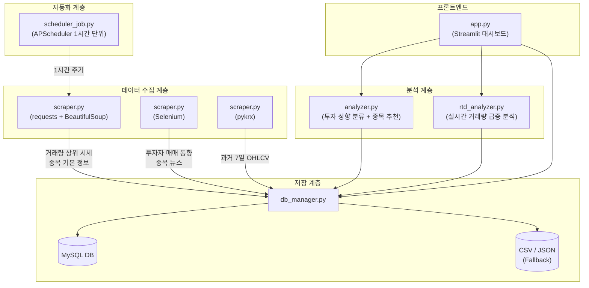
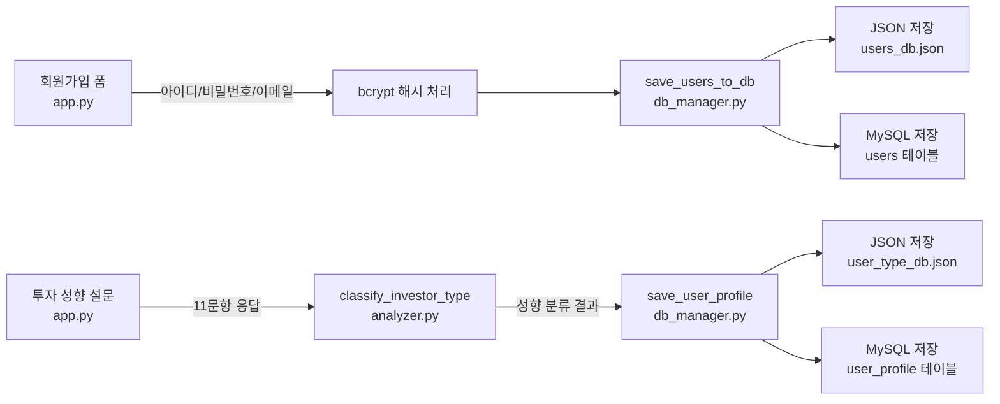

# 📊 투자 성향별 주식 추천 시스템 — 프로젝트 구조 및 코드 리뷰

> **프로젝트명**: 네이버 증권 데이터 기반 투자 성향별 주식 추천 시스템  
> **기술 스택**: Python · Streamlit · BeautifulSoup · Selenium · pykrx · MySQL · Plotly  
> **작성일**: 2026-02-25

---

## 1. 전체 아키텍처



---

## 2. 파일 구조 및 역할

```
miniproject_1/
├── app.py                  # Streamlit 대시보드 (프론트엔드 전체)
├── scraper.py              # 데이터 수집 모듈 (BS4 + Selenium + pykrx)
├── scheduler_job.py        # 1시간 주기 자동 수집 스케줄러
├── analyzer.py             # 투자 성향 분류 + 종목 추천 + 분석 신호 생성
├── rtd_analyzer.py         # 실시간 거래량 급증 분석
├── db_manager.py           # DB/CSV 저장 및 조회 관리
├── config.py               # 환경 설정 (.env 로드)
├── schema.sql              # MySQL 테이블 DDL
├── fetch_inv.py            # 외국인/기관 순매수 보정 스크립트 (pykrx)
├── main.py                 # 진입점
├── data/                   # CSV/JSON 데이터 저장 디렉토리
│   ├── stock_data_*.csv
│   ├── stock_news_*.csv
│   ├── historical_*.csv
│   ├── users_db.json
│   └── user_type_db.json
├── templates/              # HTML 템플릿
├── .env.example            # 환경 변수 예시
└── pyproject.toml          # 의존성 관리
```

---

## 3. 데이터 수집 체계 (기술별 분류)

### 3-1. `requests` + `BeautifulSoup` — 실시간 시세 수집

| 함수명 | 위치 | 수집 대상 | 사용 시점 |
|--------|------|-----------|-----------|
| `scrape_top_volume()` | `scraper.py` L116~205 | KOSPI/KOSDAQ 거래량 상위 종목 시세 | 스케줄러 1시간 단위 + 전체 파이프라인 |
| `scrape_stock_detail()` | `scraper.py` L212~302 | 종목별 시가총액, PER, PBR, 52주 최고/최저 | 전체 파이프라인 |
| `scrape_all_details()` | `scraper.py` L305~330 | 위 함수 일괄 호출 래퍼 | 전체 파이프라인 |

**핵심 코드 예시 (`scrape_top_volume`)**:
```python
# scraper.py L140~143
resp = session.get(url, timeout=10)
resp.encoding = 'euc-kr'
soup = BeautifulSoup(resp.text, 'html.parser')
rows = soup.select('table.type_2 tr')  # CSS 셀렉터로 테이블 파싱
```

**스케줄러 연동** (`scheduler_job.py`):
```python
# scheduler_job.py L68~75 — APScheduler로 평일 09~15시 매 정각 실행
scheduler.add_job(
    job_realtime_market_data,       # scrape_top_volume() 호출 함수
    'cron',
    day_of_week='mon-fri',
    hour='9-15',
    minute=0,
)
```

---

### 3-2. `pykrx` — 과거 시세 데이터 수집

| 함수명 | 위치 | 수집 대상 | 사용 시점 |
|--------|------|-----------|-----------|
| `scrape_historical_prices()` | `scraper.py` L629~676 | 과거 5~7일 OHLCV (시가/고가/저가/종가/거래량) | 전체 파이프라인 |
| `fetch_inv.py` (스크립트) | `fetch_inv.py` L1~57 | 외국인/기관 순매수량 보정 | 수동 실행 |

**핵심 코드 예시 (`scrape_historical_prices`)**:
```python
# scraper.py L640, L657
from pykrx import stock as pykrx_stock
df = pykrx_stock.get_market_ohlcv(start_str, end_str, ticker)
```

---

### 3-3. `Selenium` — 동적 페이지 수집

| 함수명 | 위치 | 수집 대상 | 사용 시점 |
|--------|------|-----------|-----------|
| `scrape_investor_trend()` | `scraper.py` L336~416 | 외국인/기관 매매 동향 | 전체 파이프라인 |
| `scrape_news()` | `scraper.py` L451~506 | 종목별 최신 뉴스 | 전체 파이프라인 |

> ⚠️ Selenium은 JavaScript 렌더링이 필요한 페이지에서만 사용합니다 (headless Chrome).

---

## 4. 전체 실행 파이프라인

`scraper.py`의 `run_full_pipeline()` (L682~814) 이 전체 흐름을 제어합니다:

```
STEP 1  [requests + BS4]   KOSPI/KOSDAQ 거래량 상위 종목 수집
STEP 2  [requests + BS4]   종목별 상세 정보 수집 (PER, PBR 등)
STEP 3  [Selenium]         투자자별 매매 동향 수집
STEP 4  [Selenium]         종목 뉴스 수집 (상위 5종목)
STEP 5  [데이터 정제]       통합 DataFrame 병합 + 결측치 처리
STEP 5-1 [pykrx]           과거 5일 시세 수집
STEP 6  [analyzer.py]      분석 신호 생성 (BUY / HOLD / SELL)
STEP 7  [analyzer.py]      추천 데이터 생성 (투자 성향 기반)
STEP 8  [analyzer.py]      뉴스레터 생성
STEP 9  [db_manager.py]    DB + CSV 저장
```

---

## 5. DB 스키마

`schema.sql` 기준, 총 7개 테이블:

| 테이블 | 역할 | 주요 컬럼 |
|--------|------|-----------|
| **(A) users** | 사용자 정보 | `user_id`, `username`, `email` |
| **(B) user_profile** | 투자 성향 매핑 | `user_id`, `risk_level`, `survey_score` |
| **(C) stocks** | 종목 마스터 | `ticker(PK)`, `name`, `market` |
| **(D) price_snapshots** | 시세 스냅샷 (실시간 누적) | `ticker`, `captured_at`, `price`, `volume` |
| **(E) analysis_signals** | 분석 신호 | `ticker`, `signal(BUY/HOLD/SELL)`, `trend_score` |
| **(F) recommendations** | 사용자별 추천 결과 | `user_id`, `ticker`, `score`, `reason` |
| **(G) newsletters** | 뉴스레터 | `user_id`, `title`, `content` |

---

## 6. 회원 시스템 흐름



---

## 7. 프론트엔드 (Streamlit) 페이지 구성

| 페이지 | 기능 | 주요 시각화 |
|--------|------|-------------|
| 🏠 메인 대시보드 | 시장 개요, 거래량 상위 50종목 | Plotly 바 차트, 산점도, Seaborn 히트맵 |
| 📋 투자 성향 설문 | 한양증권 기준 11문항 성향 진단 | 레이더 차트 |
| ⭐ 맞춤 종목 추천 | 성향별 상위 10종목 추천 + 사유 | 테이블, 점수 배지 |
| 📈 분석 신호 | BUY/HOLD/SELL 신호 현황 | 신호 분포 차트 |
| 📰 종목 뉴스 | 추천 종목 관련 최신 뉴스 | 뉴스 카드 |
| 📧 뉴스레터 | 자동 생성 뉴스레터 | 마크다운 렌더링 |
| ⏱️ 실시간 분석(RTD) | 시간대별 거래량 급증 탐지 | 바 차트, 산점도 |

---

## 8. 데이터 수집 기술 요약

```
┌──────────────────────────────────────────────────────┐
│              데이터 수집 체계 전체 구조                  │
├──────────────────────────────────────────────────────┤
│                                                      │
│  [실시간 시세]  ← requests + BeautifulSoup            │
│   • 거래량 상위 종목 (KOSPI/KOSDAQ)                    │
│   • 종목 기본 정보 (시가총액, PER, PBR)                 │
│   • 1시간 단위 스케줄링 (scheduler_job.py)             │
│                                                      │
│  [과거 시세]  ← pykrx                                 │
│   • 7일 OHLCV 데이터                                  │
│   • 외국인/기관 순매수량                                │
│                                                      │
│  [동적 페이지]  ← Selenium                            │
│   • 투자자 매매 동향 (JS 렌더링 필요)                   │
│   • 종목 뉴스 (JS 렌더링 필요)                         │
│                                                      │
│  [저장]  ← db_manager.py                             │
│   • MySQL 우선 → 실패 시 CSV/JSON Fallback            │
│                                                      │
└──────────────────────────────────────────────────────┘
```
