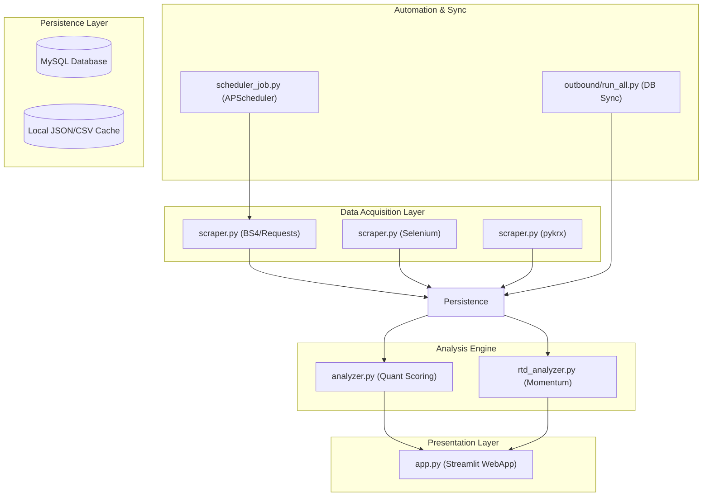

# 📊 LUMINA CAPITAL - 투자 성향 맞춤형 자산관리 시스템

> **"당신을 위한 투자의 길잡이"**  
> 네이버 금융 실시간 데이터와 정교한 투자 성향 분석 알고리즘을 결합한 맞춤형 주식 추천 대시보드입니다.

---

## 🌟 Key Features

### 1. 🏠 메인 대시보드 (Real-time Market Overview)
- **실시간 데이터 시각화**: KOSPI/KOSDAQ 거래량 상위 종목의 시세 정보를 Plotly를 이용한 인터랙티브 차트로 제공합니다.
- **시장 지표 분석**: 거래량, 등락률, 시가총액 등 주요 지표를 기반으로 한 시장 현황 파악.
- **고급 시각화**: Seaborn 히트맵과 Matplotlib을 활용한 거래대금 및 변동성 분석.

### 2. 📋 투자 성향 설문 (Investor Profiling)
- **신뢰도 높은 진단**: 한양증권 투자성향진단 기준 11문항을 기반으로 정밀한 성향 분석을 수행합니다.
- **5단계 분류**: 안정형, 안정추구형, 위험중립형, 적극투자형, 공격투자형으로 사용자 분류.
- **레이더 차트**: 사용자의 응답 데이터를 기반으로 시각적인 성향 분석 결과 제공.

### 3. ⭐ 맞춤 종목 추천 (Personalized Recommendations)
- **맞춤형 스코어링**: 사용자의 성향 가중치(배당, 시총, 변동성, 수급 등)를 반영하여 최적의 종목 10개를 추천합니다.
- **추천 사유 제공**: 왜 이 종목이 추천되었는지에 대한 퀀트 지표 기반의 친절한 설명을 동반합니다.
- **로그인 기반 서비스**: 개인별 설문 결과 및 추천 내역을 안전하게 관리합니다.

### 4. 📈 분석 신호 및 RTD (Analysis Signals & Real-time Detection)
- **BUY/HOLD/SELL 시그널**: 등락률, 거래량, 수급(외인/기관)을 종합하여 자체 알고리즘으로 생성된 투자 의견을 제공합니다.
- **RTD (Real-time Detection)**: 시간대별 거래량 급증 종목을 탐지하여 단기 모멘텀 파악 지원.

### 5. 📧 맞춤형 뉴스레터 (Personalized Newsletter)
- **매일 아침 배달되는 인사이트**: 수집된 시장 데이터와 추천 종목을 마크다운 형식의 뉴스레터로 자동 생성합니다.
- **개인화된 콘텐츠**: 사용자의 투자 성향에 맞춘 시장 요약과 추천 종목 뉴스를 포함합니다.

### 6. 🔄 Outbound DB-Local 동기화 (Automated Data Sync)
- **실시간 DB 동기화**: MySQL 클라우드 DB와 로컬 데이터 간의 원활한 동기화를 지원합니다.
- **안정적인 데이터 로드**: 네트워크 이슈 발생 시에도 로컬 JSON 캐시를 통한 안정적인 서비스 운영.

---

## 🏗️ System Architecture



---

## 🛠️ Tech Stack

| Category | Technology |
| :--- | :--- |
| **Frontend** | Streamlit, Plotly, Matplotlib, Seaborn |
| **Backend** | Python 3.12+, APScheduler |
| **Scraping** | BeautifulSoup4, Requests, Selenium, Pykrx |
| **Analysis** | Pandas, NumPy |
| **Database** | MySQL (SQLAlchemy, PyMySQL), JSON/CSV |
| **Security** | Bcrypt (Password Hashing) |
| **Package Management** | uv |

---

## 📂 Project Structure

```bash
miniproject_1/
├── app.py              # Streamlit 메인 애플리케이션
├── analyzer.py         # 투자 성향 및 종목 추천 엔진
├── scraper.py          # 멀티 소스 데이터 스크래퍼
├── scheduler_job.py    # 데이터 자동 수집 스케줄러
├── outbound/           # DB-Local 동기화 스크립트 모음
│   └── run_all.py      # 통합 동기화 마스터 스크립트
├── database_script/    # DB 테이블 관리 및 데이터 삽입 스크립트
├── data/               # 로컬 캐시 데이터 (CSV, JSON)
├── out_data/           # DB에서 추출된 최종 JSON 데이터
├── schema.sql          # MySQL 데이터베이스 스키마
└── pyproject.toml      # 의존성 및 프로젝트 메타데이터
```

---

## 🚀 Getting Started

### Prerequisites
- Python 3.12+
- `uv` (Fast Python Package Installer)

### Installation
```bash
# 1. 레포지토리 클론
git clone [repository_url]
cd miniproject_1

# 2. 의존성 설치
uv sync

# 3. 환경 변수 설정
cp .env.example .env
# .env 파일에 DB 연결 정보 입력
```

### Running the App
```bash
# Streamlit 실행
uv run streamlit run app.py

# (선택) 스케줄러 실행
uv run python scheduler_job.py
```
# 메일 수신 동의한 유저에게 해당되는 유형의 뉴스 보내기
uv run -m mailer.send_newsletters   

---

## 🗄️ Database Schema

프로젝트는 총 7개의 유기적인 테이블 구조를 가지고 있습니다.
- **users**: 사용자 계정 정보
- **user_profile**: 설문 결과 및 투자 성향 정보
- **stocks**: 종목 마스터 정보
- **price_snapshots**: 시계열 시세 데이터
- **analysis_signals**: 알고리즘 투자 신호
- **recommendations**: 성향별 종목 추천 내역
- **newsletters**: 자동 생성된 뉴스레터 아카이브

---

## 🛡️ License
이 프로젝트는 교육 및 포트폴리오 목적으로 제작되었습니다.

---
*Developed by 1팀 미니프로젝트 (LUMINA CAPITAL)*
